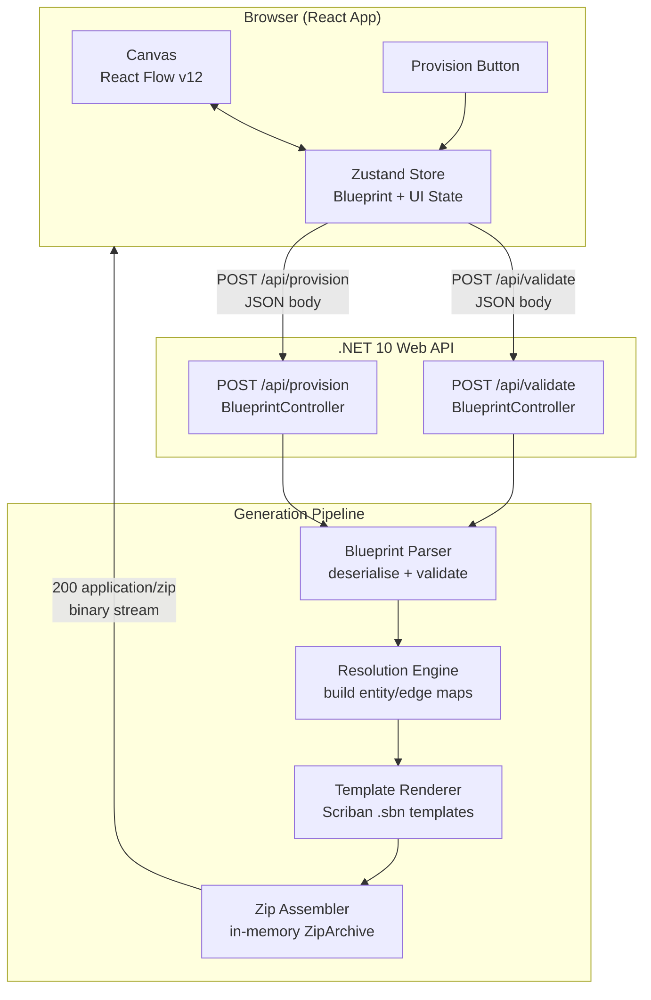
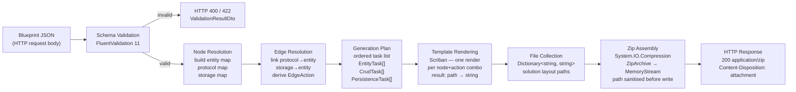
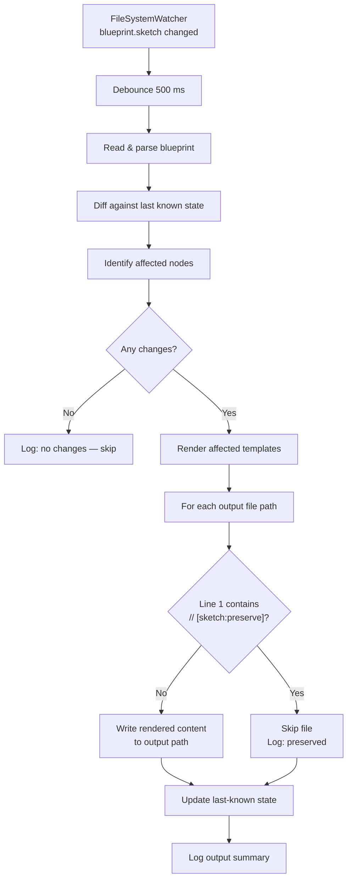

# Design Specification: Sketch MVP — "Sketch-to-CRUD"

**Feature:** Sketch Phase 1 MVP  
**Sub-Agent:** Architect  
**Status:** Draft — Part 1 of 2  
**Date:** 2026-03-31  
**Requires:** [requirements.md](./requirements.md)

---

## 1. System Overview

The Sketch MVP is a two-tier system: a browser-based visual IDE (React SPA) and a stateless .NET 10 generation API. The browser never writes to disk; every provision request is a single POST that returns a binary zip stream. The API pipeline is fully synchronous from the caller's perspective — blueprint in, zip out.



**Key constraints:**

- The API is stateless: no session, no database, no file system writes at runtime.
- All Scriban templates are embedded assembly resources. No template files ship separately.
- Provisioning is idempotent: the same blueprint always produces a byte-identical zip (deterministic GUIDs via UUID v5 keyed on project name).
- Maximum accepted blueprint payload: 512 KB. Maximum zip output: 50 MB (enforced after assembly, returns `413`).

---

## 2. Provision Sequence Flow

The full round-trip from click to download. Client-side validation runs first to avoid a round-trip for trivially empty canvases; server-side validation re-validates independently and is the authoritative source of truth.

```mermaid
sequenceDiagram
    actor User
    participant React as React App
    participant Zustand as Zustand Store
    participant APIClient as API Client
    participant API as .NET 10 Web API
    participant Parser as Blueprint Parser
    participant Planner as Resolution Engine
    participant Renderer as Template Renderer
    participant Zipper as Zip Assembler

    User->>React: Click "Provision"
    React->>Zustand: toBlueprint()
    Zustand-->>React: Blueprint JSON

    alt No entity nodes on canvas
        React-->>User: Toast — "Add at least one Entity Node"
    else Blueprint passes client-side check
        React->>Zustand: setProvisionStatus("provisioning")
        React->>APIClient: provisionBlueprint(blueprint)
        APIClient->>API: POST /api/provision\nContent-Type: application/json\n{ version, project, nodes[], edges[] }

        API->>Parser: Validate(request)

        alt Malformed JSON or missing required fields
            Parser-->>API: 400 ValidationResultDto
            API-->>APIClient: 400 JSON error body
            APIClient-->>React: throw Error(messages)
            React->>Zustand: setProvisionStatus("error")
            React-->>User: Toast — validation errors
        else Unknown node type or invalid edge
            Parser-->>API: 422 ValidationResultDto
            API-->>APIClient: 422 JSON error body
            APIClient-->>React: throw Error(messages)
            React->>Zustand: setProvisionStatus("error")
            React-->>User: Toast — semantic errors
        else Blueprint is valid
            Parser->>Parser: Parse nodes and edges\nbuild BlueprintDocument
            Parser->>Planner: Resolve(BlueprintDocument)
            Planner->>Planner: Build ordered GenerationPlan\n(entities → persistence → CRUD → Program.cs)
            Planner->>Renderer: Execute(GenerationPlan)
            Renderer->>Renderer: Render Scriban templates\nper node + action combination
            Renderer->>Zipper: Pack(Dictionary<path, string>)
            Zipper->>Zipper: Assemble ZipArchive\nin MemoryStream
            Zipper-->>API: MemoryStream (zip bytes)
            API-->>APIClient: 200 application/zip\nContent-Disposition: attachment; filename=Project.zip
            APIClient->>APIClient: response.blob() → Blob URL
            APIClient-->>React: resolved (download triggered)
            React->>React: createElement("a") → click → revokeObjectURL
            React->>Zustand: setProvisionStatus("success")
            React-->>User: Download starts + Toast — "Provisioned successfully"
        end
    end
```

---

## 3. Code Generation Pipeline

Blueprint JSON enters as a bag of unvalidated data and exits as a structured in-memory zip stream. Each stage has a single responsibility; failure at any stage short-circuits to an error response without partial output.



**Pipeline stage responsibilities:**

| Stage | Class | Failure mode |
|---|---|---|
| Schema Validation | `BlueprintValidator` (FluentValidation) | `400` missing fields; `422` unknown node type |
| Node Resolution | `ResolutionEngine` | `422` duplicate node name; `422` reserved C# keyword |
| Edge Resolution | `ResolutionEngine` | `422` illegal edge combination (see §4.4 edge rules) |
| Generation Plan | `GenerationPlannerService` | No failure — deterministic given valid resolved input |
| Template Rendering | `ScribanRenderer` | `503` if embedded resource is missing (assembly build error) |
| Zip Assembly | `ZipPackager` | `413` if assembled stream exceeds 50 MB |

Template rendering executes tasks in dependency order: `Domain` entities first, then `Infrastructure` persistence, then `Application` services and validators, then `API` controllers, finally `Program.cs`. This ensures `AppDbContext` can accumulate all `DbSet<T>` declarations in a single rendering pass.

---

## 4. Frontend Architecture

### 4.1 React Component Tree

```
App
└── CanvasPage
    ├── ReactFlowCanvas          ← React Flow wrapper; owns onConnect, onNodesChange, onEdgesChange
    │   ├── EntityNode           ← custom node component
    │   ├── ProtocolNode         ← custom node component
    │   ├── StorageNode          ← custom node component
    │   └── IdentityNode         ← custom node component (pre-configured: name=User, fields=[Id, Email, Role])
    ├── NodeToolbar              ← drag-source palette: Entity | Protocol | Storage | Identity
    ├── PropertiesPanel          ← slide-out; renders form for selectedNodeId
    ├── ProvisionButton          ← reads store; calls provisionBlueprint(); drives provisionStatus
    └── ToastNotifications       ← subscribes to provisionStatus + validationErrors
```

### 4.2 Custom Node Components

Each custom node is a React component registered in the React Flow `nodeTypes` map. They are **display-only** — mutations go through the Zustand store, not directly to React Flow internal state.

| Component | Registered key | Visual | Editable fields |
|---|---|---|---|
| `EntityNode` | `"entity"` | Blue card; field list | `name`, typed `fields[]` via PropertiesPanel |
| `ProtocolNode` | `"protocol"` | Purple card; auth badge | `name`, `style` (REST/gRPC/GraphQL), `auth` (JWT/None) |
| `StorageNode` | `"storage"` | Amber card; engine badge | `name`, `engine` (SqlServer/PostgreSQL/Redis) |
| `IdentityNode` | `"identity"` | Green card; locked fields | `name` display-only (`User`); fields are fixed |

All four node types expose React Flow **handles** (source + target) but connection legality is enforced by `isValidConnection` at the `<ReactFlow>` level (see §4.4).

### 4.3 Zustand Store

```typescript
// src/types/blueprint.ts

export type FieldType =
  | 'Guid' | 'string' | 'int' | 'decimal' | 'bool' | 'DateTime' | 'enum';

export type NodeType = 'entity' | 'protocol' | 'storage' | 'identity';
export type ProtocolStyle = 'REST' | 'gRPC' | 'GraphQL';
export type AuthType = 'JWT' | 'None';
export type StorageEngine = 'SqlServer' | 'PostgreSQL' | 'Redis';
export type EdgeAction = 'GenerateCRUD' | 'GeneratePersistence';
export type ProvisionStatus = 'idle' | 'provisioning' | 'success' | 'error';

export interface FieldDefinition {
  name: string;
  type: FieldType;
}

export interface NodeData {
  name: string;
  fields?: FieldDefinition[];      // entity / identity only
  style?: ProtocolStyle;           // protocol only
  auth?: AuthType;                 // protocol only
  engine?: StorageEngine;          // storage only
}

export interface BlueprintNode {
  id: string;
  type: NodeType;
  data: NodeData;
  position: { x: number; y: number };
}

export interface BlueprintEdge {
  id: string;
  source: string;
  target: string;
  action: EdgeAction;
}

export interface Blueprint {
  version: '1.0';
  project: string;
  nodes: BlueprintNode[];
  edges: BlueprintEdge[];
}

export interface BlueprintState {
  // ── State ──────────────────────────────────────────────────
  nodes: BlueprintNode[];
  edges: BlueprintEdge[];
  projectName: string;
  selectedNodeId: string | null;
  provisionStatus: ProvisionStatus;
  provisionError: string | null;

  // ── Derived ────────────────────────────────────────────────
  /** Serialises current state to a blueprint.sketch-compatible object. */
  toBlueprint: () => Blueprint;

  // ── Actions ────────────────────────────────────────────────
  addNode: (node: BlueprintNode) => void;
  updateNode: (id: string, patch: Partial<NodeData>) => void;
  deleteNode: (id: string) => void;   // also removes all edges connected to this node
  addEdge: (edge: BlueprintEdge) => void;
  deleteEdge: (id: string) => void;
  setProjectName: (name: string) => void;
  setProvisionStatus: (status: ProvisionStatus, error?: string) => void;
  loadBlueprint: (blueprint: Blueprint) => void;
  reset: () => void;
}
```

The store is created with `zustand/immer` middleware so mutations are expressed as direct assignments against a draft. A separate `uiStore` holds purely presentational state (panel open/closed, toast queue) that does not affect the serialised blueprint.

### 4.4 Edge Validation Rules

The `isValidConnection` callback on `<ReactFlow>` rejects illegal connections before an edge is created. The same rules are re-enforced server-side in `ResolutionEngine`; client enforcement is UX-only.

| Source type | Target type | Allowed | Edge Action assigned | Rejection code |
|---|---|:---:|---|---|
| `protocol` | `entity` | ✅ | `GenerateCRUD` | — |
| `storage` | `entity` | ✅ | `GeneratePersistence` | — |
| `protocol` | `identity` | ✅ | `GenerateCRUD` | — |
| `storage` | `identity` | ✅ | `GeneratePersistence` | — |
| `entity` | `entity` | ❌ | — | `EC-01` Direct entity relationships not supported in MVP |
| `protocol` | `storage` | ❌ | — | `EC-02` Protocol must connect to an Entity or Identity node |
| `storage` | `protocol` | ❌ | — | `EC-03` Invalid direction |
| `identity` | `*` | ❌ | — | `EC-04` Identity is target-only; cannot be a source |
| `*` | `protocol` | ❌ | — | `EC-05` Protocol nodes are sources only |
| `*` | `storage` | ❌ | — | `EC-06` Storage nodes are sources only |
| `*` | `*` (self) | ❌ | — | `EC-07` Self-connections not allowed |

```typescript
// src/utils/edgeValidation.ts

import type { Connection } from '@xyflow/react';
import type { BlueprintNode } from '../types/blueprint';

export interface EdgeValidationResult {
  valid: boolean;
  code?: string;
  reason?: string;
}

export function validateConnection(
  connection: Connection,
  nodes: BlueprintNode[]
): EdgeValidationResult {
  const source = nodes.find(n => n.id === connection.source);
  const target = nodes.find(n => n.id === connection.target);

  if (!source || !target)
    return { valid: false, code: 'EC-00', reason: 'Unknown node.' };

  if (source.id === target.id)
    return { valid: false, code: 'EC-07', reason: 'Self-connections are not allowed.' };

  const s = source.type;
  const t = target.type;

  if ((s === 'protocol' || s === 'storage') && (t === 'entity' || t === 'identity'))
    return { valid: true };

  if (s === 'entity' && t === 'entity')
    return { valid: false, code: 'EC-01', reason: 'Direct entity-to-entity edges are not supported.' };

  if (s === 'protocol' && t === 'storage')
    return { valid: false, code: 'EC-02', reason: 'Protocol Nodes must connect to Entity or Identity Nodes.' };

  if (s === 'storage' && t === 'protocol')
    return { valid: false, code: 'EC-03', reason: 'Invalid edge direction.' };

  if (s === 'identity')
    return { valid: false, code: 'EC-04', reason: 'Identity is a target-only node; it cannot be a source.' };

  if (t === 'protocol')
    return { valid: false, code: 'EC-05', reason: 'Protocol nodes are sources only.' };

  if (t === 'storage')
    return { valid: false, code: 'EC-06', reason: 'Storage nodes are sources only.' };

  return { valid: false, code: 'EC-99', reason: 'This connection type is not supported.' };
}
```

### 4.5 Canvas Auto-Save

Canvas state is persisted to `localStorage` as JSON, debounced to 2 seconds after the last mutation. On app load, the persisted blueprint is hydrated back into the Zustand store before React Flow renders.

```typescript
// src/persistence/canvasPersistence.ts

import type { Blueprint } from '../types/blueprint';

const STORAGE_KEY = 'sketch-blueprint-v1';
const DEBOUNCE_MS = 2000;

let debounceTimer: ReturnType<typeof setTimeout> | null = null;

/** Schedules a save to localStorage, debounced to 2 s. Replaces any pending save. */
export function scheduleSave(blueprint: Blueprint): void {
  if (debounceTimer !== null) clearTimeout(debounceTimer);
  debounceTimer = setTimeout(() => {
    try {
      localStorage.setItem(STORAGE_KEY, JSON.stringify(blueprint));
    } catch {
      // localStorage quota exceeded — silently drop; canvas is still usable in-session
    }
    debounceTimer = null;
  }, DEBOUNCE_MS);
}

/** Returns the last saved blueprint, or null if none exists or JSON is corrupt. */
export function loadSaved(): Blueprint | null {
  try {
    const raw = localStorage.getItem(STORAGE_KEY);
    return raw ? (JSON.parse(raw) as Blueprint) : null;
  } catch {
    return null;
  }
}

/** Clears persisted state (e.g. after an explicit "New Blueprint" action). */
export function clearSaved(): void {
  localStorage.removeItem(STORAGE_KEY);
}
```

The Zustand store subscribes to its own state changes via `store.subscribe` and calls `scheduleSave` on every mutation:

```typescript
// blueprintStore.ts — after store creation
useBlueprintStore.subscribe(state => {
  scheduleSave(state.toBlueprint());
});
```

---

## 5. Backend Project Structure

### 5.1 Solution Layout

```
Sketch.sln
├── src/
│   ├── Sketch.API/
│   │   ├── Controllers/
│   │   │   └── BlueprintController.cs
│   │   ├── Extensions/
│   │   │   └── ServiceCollectionExtensions.cs
│   │   ├── Program.cs
│   │   └── appsettings.json
│   │
│   ├── Sketch.Application/
│   │   ├── Interfaces/
│   │   │   ├── IBlueprintParser.cs
│   │   │   ├── IResolutionEngine.cs
│   │   │   ├── IScaffoldingEngine.cs
│   │   │   └── IZipPackager.cs
│   │   ├── Models/
│   │   │   ├── GenerationPlan.cs
│   │   │   ├── EntityTask.cs
│   │   │   ├── CrudTask.cs
│   │   │   ├── PersistenceTask.cs
│   │   │   └── TemplateModels/
│   │   │       ├── EntityTemplateModel.cs
│   │   │       ├── ControllerTemplateModel.cs
│   │   │       ├── DbContextTemplateModel.cs
│   │   │       └── ProgramTemplateModel.cs
│   │   └── Services/
│   │       └── GenerationPlannerService.cs
│   │
│   ├── Sketch.Domain/
│   │   └── Blueprint/
│   │       ├── BlueprintDocument.cs
│   │       ├── BlueprintNode.cs
│   │       ├── BlueprintEdge.cs
│   │       ├── BlueprintNodeData.cs
│   │       ├── BlueprintField.cs
│   │       ├── NodePosition.cs
│   │       └── Enums/
│   │           ├── NodeType.cs
│   │           ├── EdgeAction.cs
│   │           ├── ProtocolStyle.cs
│   │           ├── AuthType.cs
│   │           ├── StorageEngine.cs
│   │           └── FieldType.cs
│   │
│   └── Sketch.Infrastructure/
│       ├── Parsing/
│       │   ├── BlueprintParser.cs
│       │   └── BlueprintValidator.cs
│       ├── Scaffolding/
│       │   ├── ResolutionEngine.cs
│       │   ├── GenerationPlanner.cs
│       │   ├── ScaffoldingEngine.cs
│       │   └── ZipPackager.cs
│       ├── Templates/
│       │   ├── ScribanRenderer.cs
│       │   └── Embedded/
│       │       ├── entity.sbn
│       │       ├── enum.sbn
│       │       ├── dto.sbn
│       │       ├── service-interface.sbn
│       │       ├── service.sbn
│       │       ├── validator.sbn
│       │       ├── controller.sbn
│       │       ├── dbcontext.sbn
│       │       ├── entity-configuration.sbn
│       │       ├── program.sbn
│       │       ├── auth-extensions.sbn
│       │       ├── csproj-api.sbn
│       │       ├── csproj-application.sbn
│       │       ├── csproj-domain.sbn
│       │       ├── csproj-infrastructure.sbn
│       │       └── sln.sbn
│       └── Utilities/
│           ├── PathSanitizer.cs
│           └── DeterministicGuid.cs
│
└── tests/
    ├── Sketch.UnitTests/
    │   ├── Parsing/
    │   │   └── BlueprintValidatorTests.cs
    │   └── Scaffolding/
    │       ├── ResolutionEngineTests.cs
    │       └── TemplateRenderTests.cs
    └── Sketch.IntegrationTests/
        └── ProvisionEndpointTests.cs
```

### 5.2 Project Responsibilities and References

#### `Sketch.Domain`

The innermost layer. Contains only C# `record` types representing the parsed, strongly-typed blueprint and all enums. Has **zero project references** and zero NuGet dependencies — BCL only.

- `BlueprintDocument` — root aggregate; holds `Project`, `Version`, `IReadOnlyList<BlueprintNode>`, `IReadOnlyList<BlueprintEdge>`
- `BlueprintNode` / `BlueprintEdge` — immutable records mapping directly from the `blueprint.sketch` JSON schema
- `Enums/` — `NodeType`, `EdgeAction`, `ProtocolStyle`, `AuthType`, `StorageEngine`, `FieldType`

**References:** _(none)_

---

#### `Sketch.Application`

Owns all business logic interfaces and the generation plan model. Contains no I/O, no HTTP concerns, no template rendering. All code here is pure C# and fully unit-testable without infrastructure.

- `Interfaces/IBlueprintParser` — validate a raw DTO + parse into `BlueprintDocument`
- `Interfaces/IResolutionEngine` — resolve a `BlueprintDocument` into a `GenerationPlan`
- `Interfaces/IScaffoldingEngine` — execute a `GenerationPlan` → `Dictionary<string, string>` (file path → rendered content)
- `Interfaces/IZipPackager` — pack a `Dictionary<string, string>` → `MemoryStream`
- `Models/GenerationPlan` — ordered aggregate of `EntityTask[]`, `CrudTask[]`, `PersistenceTask[]`; carries `ProjectName`, `DotNetTarget` (`"net10.0"`), `StorageEngine`, `IncludeJwtAuth`, and the original blueprint JSON verbatim (written as `blueprint.sketch` into the zip)
- `Models/TemplateModels/` — one strongly-typed model class per `.sbn` template file; only whitelisted properties are accessible inside Scriban
- `Services/GenerationPlannerService` — the only concrete service in this layer; reads a resolved plan and emits tasks in dependency-safe order

**References:** `Sketch.Domain`

---

#### `Sketch.Infrastructure`

Contains all side-effecting implementations. Each interface from `Sketch.Application` has exactly one implementation here.

- `Parsing/BlueprintParser` — deserialises `BlueprintRequestDto` via `System.Text.Json` source generators; runs `BlueprintValidator`; maps DTO → `BlueprintDocument`
- `Parsing/BlueprintValidator` — FluentValidation 11 rule chains: required fields, node type whitelist, edge legality, reserved C# keyword check, duplicate name check, entity count limit (≤ 20 for MVP)
- `Scaffolding/ResolutionEngine` — builds entity/protocol/storage lookup maps; resolves edges to `EdgeAction`; feeds `GenerationPlannerService`
- `Scaffolding/ScaffoldingEngine` — iterates `GenerationPlan` tasks; calls `ScribanRenderer` per task; accumulates `Dictionary<string, string>`
- `Scaffolding/ZipPackager` — calls `PathSanitizer` on every entry path before write; produces `ZipArchive` over a `MemoryStream`; returns stream rewound to position 0
- `Templates/ScribanRenderer` — loads `.sbn` files from embedded resources at startup; caches parsed `Template` objects in `ConcurrentDictionary<string, Template>`; renders with explicit model objects (no arbitrary .NET calls possible in sandbox)
- `Utilities/PathSanitizer` — strips `..`, absolute path roots, null bytes, and reserved Windows filenames (`CON`, `NUL`, etc.) before any path is written to the zip
- `Utilities/DeterministicGuid` — UUID v5 (SHA-1 namespace) keyed on project name; used for `.csproj` / `.sln` GUIDs to guarantee identical output on repeated provision calls with the same blueprint

**References:** `Sketch.Application`, `Sketch.Domain`

---

#### `Sketch.API`

The HTTP boundary. Thin controllers that delegate immediately to infrastructure via Application interfaces. No business logic lives here.

- `Controllers/BlueprintController` — exposes `POST /api/validate` and `POST /api/provision`; maps validation errors to `400` / `422`; maps zip stream to `File(stream, "application/zip", filename)`; enforces the 50 MB output ceiling with a `413` response
- `Extensions/ServiceCollectionExtensions` — `AddSketch()` extension method; registers `IBlueprintParser`, `IResolutionEngine`, `IScaffoldingEngine`, `IZipPackager` as singletons (all are stateless and thread-safe)
- `Program.cs` — minimal setup: `builder.Services.AddSketch()`, `AddControllers()` with `System.Text.Json` source-generated serialiser options; CORS policy locked to the Vite dev origin in `Development` environment
- `appsettings.json` — `MaxPayloadBytes` (default `524288`), `MaxOutputBytes` (default `52428800`); no secrets stored here

**References:** `Sketch.Application`, `Sketch.Infrastructure`

---

#### `Sketch.UnitTests`

xUnit 3 + FluentAssertions. Tests target `Sketch.Infrastructure` implementations directly to assert precise parsing and rendering behaviour. No HTTP stack required.

- `Parsing/BlueprintValidatorTests` — one test class per validation rule; covers all `ValidationErrorCode` values including edge cases (reserved keywords, duplicate names, entity limit)
- `Scaffolding/ResolutionEngineTests` — verifies entity/edge map construction for each legal topology
- `Scaffolding/TemplateRenderTests` — renders each `.sbn` template with a representative model; asserts key C# tokens appear in rendered output and no Scriban parse errors are thrown

**References:** `Sketch.Infrastructure`, `Sketch.Application`, `Sketch.Domain`

---

#### `Sketch.IntegrationTests`

xUnit 3 + `Microsoft.AspNetCore.Mvc.Testing`. Spins up a `WebApplicationFactory<Program>` and exercises the full HTTP stack in-process. No external services required.

- `ProvisionEndpointTests` — full round-trips: valid blueprint → `200` + valid zip bytes; invalid blueprint → `400` JSON body; empty project name → `400`; unknown node type → `422`; payload over 512 KB → `413`; repeated provision with same blueprint → byte-identical zip (idempotency)

**References:** `Sketch.API`, `Sketch.Application`, `Sketch.Domain`

---

*Part 2 of this specification covers: API Contracts (request/response DTOs, C# controller signatures, error codes), Data Schemas (C# domain records, TypeScript DTOs, `blueprint.sketch` JSON v1.0 format), Code Generation Templates (`.sbn` file contents and rendering model per template), Generated File Matrix (all files produced per node/edge combination), Security Considerations, and Performance & Scalability Notes.*

---

## 6. API Contracts

### POST /api/provision

Accepts the full blueprint JSON and returns a binary zip archive.

- **Request body:** `application/json` — full blueprint JSON (v1.0 schema, see §7)
- **Success:** `200 OK` — `Content-Type: application/zip`, `Content-Disposition: attachment; filename="{ProjectName}.zip"`, body is raw zip bytes
- **Errors:**
  - `400 Bad Request` — missing required fields or malformed JSON; body is `ProvisionErrorResponse`
  - `422 Unprocessable Entity` — unknown node type or invalid edge combination; body is `ProvisionErrorResponse`
  - `413 Content Too Large` — assembled zip output exceeds 50 MB

```csharp
// Sketch.API/Controllers/BlueprintController.cs (DTOs)

/// <summary>Deserialisation target for POST /api/provision and POST /api/validate.</summary>
public sealed record BlueprintRequest(
    string Version,
    string Project,
    IReadOnlyList<BlueprintNodeDto> Nodes,
    IReadOnlyList<BlueprintEdgeDto> Edges
);

public sealed record BlueprintNodeDto(
    string Id,
    string Type,
    NodeDataDto Data,
    PositionDto Position
);

public sealed record BlueprintEdgeDto(
    string Id,
    string Source,
    string Target,
    string Action
);

public sealed record NodeDataDto(
    string Name,
    IReadOnlyList<FieldDefinitionDto>? Fields,
    string? Style,
    string? Auth,
    string? Engine
);

public sealed record FieldDefinitionDto(
    string Name,
    string Type
);

public sealed record PositionDto(double X, double Y);

/// <summary>Returned for 400 and 422 responses.</summary>
public sealed record ProvisionErrorResponse(
    string Code,
    string Message,
    IReadOnlyList<string> Errors
);
```

### POST /api/validate

Accepts the same blueprint JSON and returns a structured validation result without performing generation.

- **Request body:** `application/json` — full blueprint JSON (v1.0 schema)
- **Success:** `200 OK` — `Content-Type: application/json`, body is `ValidationResult`

```csharp
/// <summary>Response body for POST /api/validate.</summary>
public sealed record ValidationResult(
    bool IsValid,
    IReadOnlyList<ValidationError> Errors
);

public sealed record ValidationError(
    string Code,
    string Field,
    string Message
);
```

---

## 7. Data Schemas

### TypeScript (Frontend)

Blueprint types are defined in `src/types/blueprint.ts` — see §4.3 for the full listing. The canonical serialised format is a JSON object matching the `Blueprint` interface:

```jsonc
{
  "version": "1.0",
  "project": "OrdersAPI",
  "nodes": [
    {
      "id": "node-1",
      "type": "entity",
      "data": {
        "name": "Order",
        "fields": [
          { "name": "Id", "type": "Guid" },
          { "name": "Total", "type": "decimal" }
        ]
      },
      "position": { "x": 100, "y": 150 }
    }
  ],
  "edges": [
    { "id": "edge-1", "source": "node-2", "target": "node-1", "action": "GenerateCRUD" }
  ]
}
```

### C# Domain Model (`Sketch.Domain`)

```csharp
// Sketch.Domain/Blueprint/BlueprintDocument.cs
public sealed record BlueprintDocument(
    string Version,
    string ProjectName,
    IReadOnlyList<BlueprintNode> Nodes,
    IReadOnlyList<BlueprintEdge> Edges
);

// Sketch.Domain/Blueprint/BlueprintNode.cs
public sealed record BlueprintNode(
    string Id,
    NodeType Type,
    NodeData Data,
    NodePosition Position
);

// Sketch.Domain/Blueprint/BlueprintEdge.cs
public sealed record BlueprintEdge(
    string Id,
    string SourceId,
    string TargetId,
    EdgeAction Action
);

// Sketch.Domain/Blueprint/NodeData.cs
public sealed record NodeData(
    string Name,
    IReadOnlyList<FieldDefinition>? Fields,
    ProtocolStyle? Style,
    AuthStyle? Auth,
    StorageEngine? Engine
);

// Sketch.Domain/Blueprint/FieldDefinition.cs
public sealed record FieldDefinition(string Name, FieldType Type);

// Sketch.Domain/Blueprint/Enums/NodeType.cs
public enum NodeType { Entity, Protocol, Storage, Identity }

// Sketch.Domain/Blueprint/Enums/FieldType.cs
public enum FieldType { Guid, String, Int, Decimal, Bool, DateTime, Enum }

// Sketch.Domain/Blueprint/Enums/ProtocolStyle.cs
public enum ProtocolStyle { REST }

// Sketch.Domain/Blueprint/Enums/AuthStyle.cs
public enum AuthStyle { JWT, None }

// Sketch.Domain/Blueprint/Enums/StorageEngine.cs
public enum StorageEngine { SqlServer }

// Sketch.Domain/Blueprint/Enums/EdgeAction.cs
public enum EdgeAction { GenerateCRUD, GeneratePersistence }

// Sketch.Application/Models/GenerationPlan.cs
public sealed record GenerationPlan(
    string ProjectName,
    IReadOnlyList<EntityTask> EntityPlans,
    IReadOnlyList<PersistenceTask> PersistencePlans,
    IReadOnlyList<CrudTask> CRUDPlans,
    AuthPlan AuthPlan
);
```

---

## 8. Technology Stack Decisions

| Library | Version | Layer | Justification | Alternative Considered |
|---|---|---|---|---|
| React | 19 | Frontend | Ecosystem maturity; concurrent rendering; large React Flow community | Svelte — smaller bundle but less React Flow alignment |
| React Flow (`@xyflow/react`) | 12 | Frontend | Purpose-built node-edge canvas; handles drag, connect, zoom; headless hooks available | D3 — lower-level, far more implementation effort |
| Zustand | 5 | Frontend | Minimal boilerplate; immer middleware for immutable updates; no Provider wrapping | Redux Toolkit — more boilerplate than warranted for this scope |
| TypeScript | 5.7 | Frontend | Type safety for blueprint schemas; eliminates runtime field-access errors | JavaScript — no meaningful benefit, sacrifice of correctness |
| Vite | 6 | Frontend | Sub-second HMR; native ESM; trivial proxy config for API calls | Create React App — deprecated; Webpack — slower cold starts |
| .NET 10 | 10.0 | Backend | LTS; AOT-ready; latest minimal API improvements; native source-gen JSON | .NET 8 — active LTS but no new API improvements needed |
| ASP.NET Core | 10.0 | Backend | Built-in rate limiting middleware; `IResult` for streaming zip responses; native OpenAPI 3.1 | FastEndpoints — adds dependency without meaningful gain at this scale |
| Scriban | 5.x | Backend | No Razor runtime; string-only templates; sandboxed by default; compiled at startup; actively maintained | RazorLight — requires Razor runtime compilation, slower startup, harder to sandbox |
| System.IO.Compression | BCL | Backend | In-box; no NuGet; `ZipArchive` over `MemoryStream` for streaming zip assembly | SharpZipLib — third-party, no advantage over BCL for this use case |
| FluentValidation | 11 | Backend | Declarative rule chains; clean separation from controller layer; easy async extension | DataAnnotations — insufficient for cross-field rules (edge legality, keyword checks) |
| EF Core | 9.x | Generated output only | Standard ORM for generated `AppDbContext`; **not used in the engine itself** — only rendered into templates | Dapper — less scaffoldable for the generated layer |

---

## 9. Performance Notes

**Generation time budget — target < 10 seconds for a single entity:**

| Stage | Budget |
|---|---|
| Schema validation (FluentValidation) | < 50 ms |
| Blueprint parsing + node resolution | < 100 ms |
| Template rendering (Scriban, ~15 files max) | < 500 ms per file |
| Zip assembly (ZipArchive + MemoryStream) | < 1 s |
| HTTP overhead (serialisation, network) | < 500 ms |
| **Total** | **< 10 s** |

**Zip streaming:** `ZipArchive` is constructed over a `MemoryStream`. For outputs approaching the 50 MB ceiling, consider enabling chunked transfer encoding (`Transfer-Encoding: chunked`) by not setting `Content-Length` and returning the stream directly via `Results.Stream`.

**Template caching:** All Scriban `.sbn` templates are read from embedded assembly resources and compiled to `Scriban.Template` objects exactly once at application startup. The compiled templates are stored in a `ConcurrentDictionary<string, Template>` inside `ScribanRenderer`. Subsequent renders call `template.Render(model)` with no re-parse overhead.

**Concurrency:** `POST /api/provision` is fully stateless. Each request instantiates its own `MemoryStream` and `ZipArchive`. No shared mutable state exists between requests; all registered services are singletons with thread-safe implementations. The endpoint is freely parallelisable with no locking.

---

## 10. Security Considerations

**Zip path traversal:** Before any `ZipArchiveEntry` is created, `PathSanitizer.Sanitize(path)` is called. The sanitizer: strips all `..` path segments, rejects absolute paths (leading `/`, `\`, or drive letters), removes null bytes (`\0`), and rejects Windows reserved filenames (`CON`, `PRN`, `AUX`, `NUL`, `COM1`–`COM9`, `LPT1`–`LPT9`). Any path that fails sanitization causes a `503` internal error (assembly build defect) rather than silently writing to an unsafe location.

**Project name sanitization:** The raw `project` field from the JSON body is sanitized by applying `Regex.Replace(input, "[^a-zA-Z0-9]", "")` then converting to PascalCase. If the result is an empty string after sanitization, the request is rejected with `400` and error code `PN-01`.

**Field name sanitization:** Field names are validated against the full C# reserved keyword list. Any name matching the following pattern is rejected with `422` and error code `FN-01`:

```
^(abstract|as|base|bool|break|byte|case|catch|char|checked|class|const|continue|decimal|
default|delegate|do|double|else|enum|event|explicit|extern|false|finally|fixed|float|for|
foreach|goto|if|implicit|in|int|interface|internal|is|lock|long|namespace|new|null|object|
operator|out|override|params|private|protected|public|readonly|ref|return|sbyte|sealed|
short|sizeof|stackalloc|static|string|struct|switch|this|throw|true|try|typeof|uint|ulong|
unchecked|unsafe|ushort|using|virtual|void|volatile|while)$
```

**No code execution:** The engine exclusively renders string templates via Scriban and writes the results to a `MemoryStream`. There is no dynamic compilation (`Roslyn`, `Assembly.Load`), no `Process.Start`, no `eval`, and no filesystem writes at runtime. Scriban's sandbox prevents templates from accessing arbitrary .NET APIs.

**Rate limiting:** ASP.NET Core rate limiting middleware is configured in `Program.cs` with a fixed-window policy: **10 provision requests per IP per minute**. Clients exceeding the limit receive `429 Too Many Requests`.

**Input size limits:**
- Request bodies larger than 1 MB are rejected at the middleware layer with `413` before reaching the controller.
- Blueprints containing more than 20 nodes are rejected with `422` and error code `BK-01` by `BlueprintValidator`.

---

## 11. Template Engine Decision: Scriban vs RazorLight

| Criteria | Scriban | RazorLight |
|---|---|---|
| .NET 10 compatibility | ✅ Full support | ⚠️ Partial — Razor runtime has known .NET 10 gaps |
| Determinism | ✅ Pure string rendering; no runtime state | ⚠️ Depends on Razor compilation cache behaviour |
| No runtime compilation | ✅ Templates pre-compiled at startup | ❌ Compiles Razor views to assemblies at runtime |
| Sandboxed execution | ✅ Scriban sandbox blocks arbitrary .NET calls | ❌ Razor templates execute as full .NET code |
| Template syntax simplicity | ✅ Liquid-like; readable by non-C# contributors | ⚠️ Full Razor/C# — requires C# knowledge to author |
| NuGet package health | ✅ Actively maintained (Scriban 5.x, 2024 releases) | ⚠️ Lower activity; fewer recent releases |
| Startup overhead | Low — `Template.Parse` is fast; cached in `ConcurrentDictionary` | Higher — Razor compilation pipeline is heavier |

**Decision: Scriban is selected.**

Justification: Scriban requires no Razor runtime, renders purely as string transformation, compiles templates at startup with negligible overhead, sandboxes template execution by default (preventing accidental or malicious .NET API calls from within a template), and is actively maintained with .NET 10 compatibility. RazorLight's runtime compilation model conflicts with the engine's security requirement of no dynamic code execution.

---

## 12. Live Sync CLI Design (Stretch Goal)

**Tool name:** `sketch-watch`

**Installation:**
```bash
dotnet tool install -g sketch-watch
```

**Usage:**
```bash
sketch-watch --blueprint ./blueprint.sketch --output ./src --dry-run
```

| Flag | Description |
|---|---|
| `--blueprint` | Path to the `.sketch` JSON blueprint file to watch |
| `--output` | Root directory to write generated files into |
| `--dry-run` | Print planned file writes without touching the filesystem |

**Architecture:**

A `FileSystemWatcher` monitors the `blueprint.sketch` file for write events. Events are debounced by 500 ms to avoid re-triggering on rapid successive saves. On each debounce tick:

1. Read and parse the current blueprint
2. Diff against the last known in-memory state to identify changed, added, or removed nodes
3. Re-render only the templates affected by changed nodes (skip unchanged entities)
4. For each output file path, read line 1 — if it contains the marker `// [sketch:preserve]`, skip the file and log a skip notice
5. Write the rendered content to the output path
6. Update last-known state

**Preserve marker convention:**

Any generated file that has been manually edited should have `// [sketch:preserve]` added as its first line. `sketch-watch` will never overwrite files bearing this marker, preventing loss of hand-written customisations.

**File change flowchart:**


