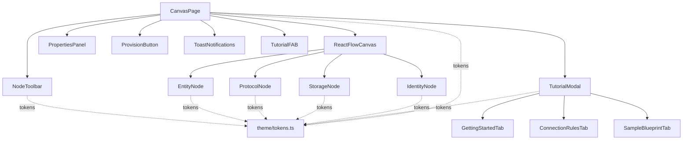
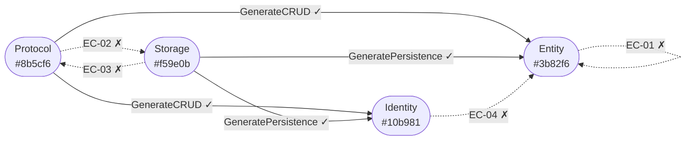
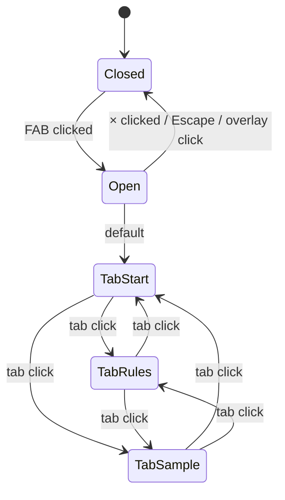

# Design Spec: Sketch UI/UX Fixes & DTO Bug Patch

**Feature Folder**: `docs/features/sketch-ui-ux-fixes/`  
**Architect**: GitHub Copilot  
**Status**: Ready for Implementation  
**Date**: 2026-03-31  
**Depends on**: `requirements.md` (approved)

---

## 0. Overview

Three independent implementation tracks. Each is self-contained and can be merged separately.

| Track | Issue | Scope | Risk |
|-------|-------|-------|------|
| A | DTO Syntax Bug | 3-line string literal fix in `ScribanRenderer.cs` | Low |
| B | UI Polish | 7 existing `.tsx` files + 1 new `tokens.ts` | Medium |
| C | Tutorial Modal | 1 new `TutorialModal.tsx` + edits to `CanvasPage.tsx` | Low |

---

## Track A — DTO Syntax Bug Fix

### A.1 Root Cause Analysis

`ScaffoldingEngine` builds `FieldLines` using the format:

```
"public Guid Id { get; set; }"
"public string Name { get; set; }"
"public Guid DepartmentId { get; set; }"
```

`ScribanRenderer.RenderDto()` attempts to strip both the `public ` prefix and the property accessor suffix from these lines to produce positional record parameters. The prefix strip is correct. The suffix strip uses the wrong literal:

```csharp
// WRONG — no-op, accessor never matches
.Replace(" { get; init; }", string.Empty)

// CORRECT
.Replace(" { get; set; }", string.Empty)
```

Because the Replace is a no-op, the generated record parameters still contain `public` and `{ get; set; }`, which is not valid C# record parameter syntax:

```csharp
// BROKEN output — does not compile
public record EmployeeDto(
    public Guid Id { get; set; },
    public string Name { get; set; },
    public Guid DepartmentId { get; set; });
```

### A.2 Exact File Change

**File**: `src/Sketch.Infrastructure/Scaffolding/ScribanRenderer.cs`  
**Method**: `RenderDto`  
**Change count**: 3 identical replacements (one per generated record type)

Replace every occurrence of:
```csharp
.Replace(" { get; init; }", string.Empty)
```
with:
```csharp
.Replace(" { get; set; }", string.Empty)
```

The three occurrences are:

1. Inside the `EmployeeDto(...)` interpolation  
2. Inside the `CreateEmployeeRequest(...)` interpolation (inside the `.Where(...).Select(...)` chain)  
3. Inside the `UpdateEmployeeRequest(...)` interpolation (inside the `.Where(...).Select(...)` chain)

No other changes to `RenderDto`. Do not touch `RenderEntity` — it already uses `"{ get; set; }"` correctly in a different Replace for a different purpose.

### A.3 Expected Output After Fix

Input FieldLines for `Employee`:
```
["public Guid Id { get; set; }", "public string Name { get; set; }", "public Guid DepartmentId { get; set; }"]
```

Expected rendered output:
```csharp
namespace MyProject.Application.DTOs;

public record EmployeeDto(
    Guid Id,
    string Name,
    Guid DepartmentId);

public record CreateEmployeeRequest(
    string Name,
    Guid DepartmentId);

public record UpdateEmployeeRequest(
    string Name,
    Guid DepartmentId);
```

### A.4 Test Coverage

Engineer must add a new test class `ScribanRendererTests` in `tests/Sketch.UnitTests/`:

**Test method**: `RenderDto_StripsPublicPrefixAndAccessors`  
**Input**: `DtoTemplateModel` with `EntityName = "User"`, `ProjectName = "TestProject"`, and `FieldLines = ["public Guid Id { get; set; }", "public string Name { get; set; }", "public string Email { get; set; }"]`  
**Assert**: Output contains `"Guid Id,"`, `"string Name,"`, `"string Email)"` and does NOT contain `"public "` or `"{ get; set; }"` in any parameter position.

---

## Track B — UI Polish

### B.1 Design Token System

**File to create**: `src/Sketch.Web/src/theme/tokens.ts`

This file is the single source of truth for all colors, spacing, and typography. All edited components must import from here rather than using inline hex literals.

```typescript
export const tokens = {
  bg: {
    canvas:  '#0f172a',     // slate-950 — page background
    surface: '#1e293b',     // slate-800 — cards, panels, header
    raised:  '#273548',     // slate-750 — hovered or elevated surfaces
    overlay: 'rgba(15,23,42,0.75)', // modal backdrop
  },
  border: {
    default: '#334155',     // slate-700
    subtle:  '#1e293b',     // slate-800 — internal dividers
    focus:   '#0ea5e9',     // sky-500 — active inputs
  },
  text: {
    primary:   '#f1f5f9',   // slate-100
    secondary: '#94a3b8',   // slate-400
    muted:     '#475569',   // slate-600
  },
  node: {
    entity:   { base: '#3b82f6', dark: '#1d4ed8', ring: '#93c5fd' },
    protocol: { base: '#8b5cf6', dark: '#6d28d9', ring: '#c4b5fd' },
    storage:  { base: '#f59e0b', dark: '#b45309', ring: '#fcd34d' },
    identity: { base: '#10b981', dark: '#047857', ring: '#6ee7b7' },
  },
  accent: '#0ea5e9',        // sky-500 — buttons, links, focus rings
  danger: '#ef4444',        // red-500 — Clear button hover
  space: { xs: 4, sm: 8, md: 12, lg: 16, xl: 24, xxl: 32 } as const,
  radius: { sm: 4, md: 6, lg: 8, xl: 12 } as const,
  font: {
    sans: "'Inter', system-ui, sans-serif",
    mono: "'JetBrains Mono', 'Fira Code', monospace",
  },
} as const;

export type NodeKind = keyof typeof tokens.node;
```

### B.2 Improved NodeToolbar

**File**: `src/Sketch.Web/src/components/NodeToolbar/NodeToolbar.tsx`

#### B.2.1 Updated `PaletteItem` Interface

```typescript
interface PaletteItem {
  type: NodeType;
  label: string;
  icon: string;          // Unicode symbol (no emoji for consistency)
  description: string;   // one-line description shown below label
  hint: string;          // connection direction hint
  accentColor: string;
  ringColor: string;
}
```

#### B.2.2 Updated `PALETTE_ITEMS` Data

```typescript
const PALETTE_ITEMS: PaletteItem[] = [
  {
    type: 'entity',
    label: 'Entity',
    icon: '▣',
    description: 'Domain model with typed fields',
    hint: '← receives from Protocol & Storage',
    accentColor: tokens.node.entity.base,
    ringColor: tokens.node.entity.ring,
  },
  {
    type: 'protocol',
    label: 'Protocol',
    icon: '⇄',
    description: 'API surface — REST, gRPC, or GraphQL',
    hint: '→ connects to Entity or Identity',
    accentColor: tokens.node.protocol.base,
    ringColor: tokens.node.protocol.ring,
  },
  {
    type: 'storage',
    label: 'Storage',
    icon: '⬡',
    description: 'Database or cache backend',
    hint: '→ connects to Entity or Identity',
    accentColor: tokens.node.storage.base,
    ringColor: tokens.node.storage.ring,
  },
  {
    type: 'identity',
    label: 'Identity',
    icon: '◉',
    description: 'ASP.NET Core Identity user model',
    hint: '← receives from Protocol & Storage',
    accentColor: tokens.node.identity.base,
    ringColor: tokens.node.identity.ring,
  },
];
```

#### B.2.3 Layout and Styling

| Property | Value |
|----------|-------|
| `aside` width | **180px** (was 140px) |
| `aside` padding | `12px 10px` |
| `aside` background | `tokens.bg.surface` |
| `aside` borderRight | `1px solid tokens.border.default` |
| gap between cards | `8px` |

Each `PaletteCard`:
- `background: tokens.bg.raised`
- `borderLeft: 3px solid {item.accentColor}`
- `borderRadius: tokens.radius.md`
- `padding: 9px 10px`
- `cursor: grab`
- Top row: icon (16px, `accentColor`) + label (13px bold, `tokens.text.primary`) side-by-side with `gap: 7`
- Description row: 11px, `tokens.text.secondary`, `marginTop: 4`, `lineHeight: 1.4`
- Hint row: 10px, `tokens.text.muted`, `fontStyle: italic`, `marginTop: 4`
- **Hover**: `background` lifts to `#2d3f52`, `outline: 1px solid {item.ringColor}`
- **Active/dragging**: `transform: scale(0.97)`, `cursor: grabbing`

#### B.2.4 Component Skeleton

```tsx
export function NodeToolbar() {
  return (
    <aside style={{ width: 180, padding: '12px 10px', background: tokens.bg.surface,
                    display: 'flex', flexDirection: 'column', gap: 8,
                    borderRight: `1px solid ${tokens.border.default}`,
                    userSelect: 'none', flexShrink: 0 }}>
      <div style={{ color: tokens.text.muted, fontSize: 10, fontWeight: 700,
                    letterSpacing: '0.08em', marginBottom: 4 }}>
        NODE PALETTE
      </div>
      {PALETTE_ITEMS.map((item) => (
        <PaletteCard key={item.type} item={item} />
      ))}
    </aside>
  );
}

function PaletteCard({ item }: { item: PaletteItem }) {
  function onDragStart(e: DragEvent<HTMLDivElement>) {
    e.dataTransfer.setData('application/sketch-node-type', item.type);
    e.dataTransfer.effectAllowed = 'move';
  }
  return (
    <div draggable onDragStart={onDragStart}
         style={{ background: tokens.bg.raised,
                  borderLeft: `3px solid ${item.accentColor}`,
                  borderRadius: tokens.radius.md,
                  padding: '9px 10px', cursor: 'grab' }}>
      <div style={{ display: 'flex', alignItems: 'center', gap: 7 }}>
        <span style={{ fontSize: 16, color: item.accentColor }}>{item.icon}</span>
        <span style={{ fontWeight: 600, fontSize: 13, color: tokens.text.primary }}>
          {item.label}
        </span>
      </div>
      <p style={{ margin: '4px 0 0', fontSize: 11, color: tokens.text.secondary, lineHeight: 1.4 }}>
        {item.description}
      </p>
      <p style={{ margin: '4px 0 0', fontSize: 10, color: tokens.text.muted, fontStyle: 'italic' }}>
        {item.hint}
      </p>
    </div>
  );
}
```

### B.3 Improved Node Cards

All four node components adopt a shared visual pattern: dark base surface + colored left-border accent + type badge in the header row. The solid-color background is removed.

#### B.3.1 Shared Visual Pattern

```
┌──[3px accent]─────────────────────────────────────┐
│  {icon}  NodeName                    [TYPE BADGE]  │
│  ─────────────────────────────────────────────     │
│  ∎ FieldName          string                       │
│  ∎ AnotherField       Guid                         │
│  ─────────────────────────────────────────────     │
│  ← accepts connections from Protocol / Storage     │  (muted, 10px)
└────────────────────────────────────────────────────┘
```

#### B.3.2 Shared Style Rules

| Property | Default state | Selected state |
|----------|---------------|----------------|
| `background` | `tokens.bg.surface` | `tokens.bg.raised` |
| `borderLeft` | `3px solid {node}.base` | `3px solid {node}.ring` |
| `border` (box) | `1px solid transparent` | `1px solid {node}.ring` |
| `boxShadow` | none | `0 0 0 3px {node}.base` at 25% opacity |
| `borderRadius` | `tokens.radius.lg` (8px) | same |
| `minWidth` | `170px` | same |
| `padding` | `10px 14px` | same |
| `color` | `tokens.text.primary` | same |
| `fontSize` | `13px` | same |
| `fontFamily` | `tokens.font.sans` | same |

#### B.3.3 Type Badge

Inline `<span>` floated right in the header row:
```
background: {node}.base at 20% opacity
color: {node}.ring
border: 1px solid {node}.base
borderRadius: tokens.radius.sm
fontSize: 9px
fontWeight: 700
letterSpacing: 0.08em
padding: 1px 6px
textTransform: uppercase
```

#### B.3.4 Field List Rows

Replace `<ul>/<li>` with `<div>` rows:
```
display: flex
justifyContent: space-between
padding: 2px 0
fontSize: 12px
```
- Field name: `color: tokens.text.primary`
- Type value: `color: tokens.text.muted`, `fontFamily: tokens.font.mono`
- Row separator: not needed; vertical gap of `2px` is sufficient

#### B.3.5 Connection Hint Footer

All four cards show a static footer below fields (or below metadata for Protocol/Storage):
```
borderTop: 1px solid tokens.border.subtle
marginTop: 8px
paddingTop: 6px
fontSize: 10px
color: tokens.text.muted
fontStyle: italic
```

| Node Type | Hint text |
|-----------|-----------|
| Entity | `← accepts edges from Protocol and Storage` |
| Identity | `← accepts edges from Protocol and Storage` |
| Protocol | `→ drag handle to connect to Entity or Identity` |
| Storage | `→ drag handle to connect to Entity or Identity` |

#### B.3.6 Per-Component Changes

**EntityNode** — receives `Handle type="target"` on Left, `Handle type="source"` on Right (unchanged). Apply shared pattern. Icon: `▣`.

**ProtocolNode** — source only (`Handle type="source"` on Right, no target handle). Apply shared pattern. Icon: `⇄`. Below name: protocol style pill (`REST`/`gRPC`/`GraphQL`) + auth badge. Auth badge colors: JWT → `#f59e0b`, None → `tokens.text.muted`.

**StorageNode** — source only (`Handle type="source"` on Right). Apply shared pattern. Icon: `⬡`. Below name: engine tag (`SqlServer` / `PostgreSQL` / `Redis`).

**IdentityNode** — receives `Handle type="target"` on Left only (no source handle — note: current code incorrectly has a source handle; keep as-is since `edgeValidation.ts` EC-04 blocks it at runtime). Apply shared pattern. Icon: `◉`. Hardcoded fields: `Id: Guid`, `Email: string`, `Role: enum`.

### B.4 Improved Header Bar

**File**: `src/Sketch.Web/src/pages/CanvasPage.tsx`

#### B.4.1 Layout

| Zone | Left (flex row) | Right (flex row) |
|------|-----------------|------------------|
| Contents | Logo mark + pipe + project name (editable) | Node count chip + Clear button + Provision button |

Height: **56px** (was 52px).

#### B.4.2 Logo Mark

Replace `✏️ Sketch` emoji+text with:
```tsx
<div style={{ display: 'flex', alignItems: 'center', gap: 8 }}>
  {/* SVG pencil icon — 18×18, stroke: tokens.accent, strokeWidth: 2 */}
  <svg width="18" height="18" viewBox="0 0 24 24" fill="none"
       stroke={tokens.accent} strokeWidth="2" strokeLinecap="round" strokeLinejoin="round">
    <path d="M17 3a2.85 2.83 0 1 1 4 4L7.5 20.5 2 22l1.5-5.5Z"/>
  </svg>
  <span style={{ fontWeight: 800, fontSize: 17, color: tokens.text.primary,
                 fontFamily: tokens.font.sans, letterSpacing: '-0.01em' }}>
    Sketch
  </span>
</div>
```

#### B.4.3 Pipe Separator

```tsx
<span style={{ color: tokens.border.default, fontSize: 18, fontWeight: 300 }}>|</span>
```

#### B.4.4 Project Name (editable)

Resting state button:
- `background: none`, `border: 1px solid transparent`, `color: tokens.text.primary`
- `fontSize: 14`, `fontWeight: 600`, `borderRadius: tokens.radius.sm`, `padding: 4px 8px`
- Hover: `background: tokens.bg.canvas`, `border-color: tokens.border.default`

Editing state input:
- Same dimensions; `border-color: tokens.border.focus`
- `background: tokens.bg.canvas`

#### B.4.5 Node Count Chip (new)

Read `nodes.length` from store with `useBlueprintStore((s) => s.nodes.length)`.

```tsx
<span style={{ background: tokens.bg.canvas, border: `1px solid ${tokens.border.default}`,
               borderRadius: 9999, padding: '3px 10px', fontSize: 11,
               color: tokens.text.muted, fontVariantNumeric: 'tabular-nums' }}>
  {nodeCount} node{nodeCount !== 1 ? 's' : ''}
</span>
```

#### B.4.6 Clear Button

```tsx
<button style={{ background: tokens.bg.canvas, border: `1px solid ${tokens.border.default}`,
                 color: tokens.text.secondary, borderRadius: tokens.radius.sm,
                 padding: '6px 14px', fontSize: 12, cursor: 'pointer' }}
        /* Hover (CSS class or inline state): border-color: tokens.danger, color: tokens.danger */>
  Clear
</button>
```

#### B.4.7 Provision Button

No structural change to `ProvisionButton.tsx`. Apply consistent `borderRadius: tokens.radius.md` and match padding `10px 20px`. Color tokens already match (`#0ea5e9`).

---

## Track C — Tutorial Modal

### C.1 Architecture

Two new pieces added to `CanvasPage`:

```
CanvasPage
 ├─ (existing: Header, NodeToolbar, ReactFlowCanvas, PropertiesPanel, ProvisionButton, Toast)
 ├─ TutorialFAB          ← fixed ? button, always visible
 └─ TutorialModal        ← conditional on isTutorialOpen state
```

State is local to `CanvasPage` — no store changes required:

```typescript
const [isTutorialOpen, setIsTutorialOpen] = useState(false);
```

`TutorialFAB` and `TutorialModal` are both exported from `src/Sketch.Web/src/components/Tutorial/TutorialModal.tsx`.

### C.2 Component: `TutorialFAB`

**Props**:
```typescript
interface TutorialFABProps {
  onClick: () => void;
}
```

**Visual spec**:

| Property | Value |
|----------|-------|
| `position` | `fixed` |
| `bottom` | `28px` |
| `right` | `28px` |
| `zIndex` | `9999` |
| `width` / `height` | `48px` |
| `borderRadius` | `50%` |
| `background` | `tokens.node.protocol.base` (`#8b5cf6`) |
| `border` | `2px solid tokens.node.protocol.ring` |
| `boxShadow` | `0 4px 16px rgba(139,92,246,0.35)` |
| `color` | `white` |
| `fontSize` | `22px` |
| `fontWeight` | `700` |
| `cursor` | `pointer` |
| label | `?` |
| Hover | `background: tokens.node.protocol.dark`, `transform: scale(1.06)` |
| `transition` | `background 0.15s, transform 0.15s` |

### C.3 Component: `TutorialModal`

**File**: `src/Sketch.Web/src/components/Tutorial/TutorialModal.tsx`

#### C.3.1 Props

```typescript
interface TutorialModalProps {
  onClose: () => void;
}
```

#### C.3.2 Internal State

```typescript
type TutorialTab = 'start' | 'rules' | 'sample';
const [activeTab, setActiveTab] = useState<TutorialTab>('start');
```

#### C.3.3 Keyboard Dismiss

```typescript
useEffect(() => {
  const handler = (e: KeyboardEvent) => {
    if (e.key === 'Escape') onClose();
  };
  window.addEventListener('keydown', handler);
  return () => window.removeEventListener('keydown', handler);
}, [onClose]);
```

#### C.3.4 DOM Structure

```
<div> Overlay
  position: fixed, inset: 0, zIndex: 9998
  background: tokens.bg.overlay
  backdropFilter: blur(4px)
  display: flex, alignItems: center, justifyContent: center
  onClick: onClose   ← click-outside dismisses

  <div> Modal Card
    onClick: stopPropagation  ← prevent bubble to overlay
    background: tokens.bg.surface
    border: 1px solid tokens.border.default
    borderRadius: tokens.radius.xl (12px)
    width: min(680px, calc(100vw - 40px))
    maxHeight: calc(100vh - 80px)
    display: flex, flexDirection: column
    boxShadow: 0 24px 64px rgba(0,0,0,0.6)

    <div> Modal Header (56px, flex, alignItems: center, px: 24, borderBottom)
      <span> "How to use Sketch"
        fontSize: 16, fontWeight: 700, color: tokens.text.primary
      <button> × close
        marginLeft: auto, background: none, border: none
        color: tokens.text.muted, fontSize: 20, cursor: pointer

    <div> Tab Bar (48px, flex, borderBottom: 1px solid tokens.border.default, px: 4)
      {['start','rules','sample'].map(tab => <TabButton>)}

    <div> Tab Content
      flex: 1, overflowY: auto, padding: 24px
      { activeTab === 'start'  && <GettingStartedTab /> }
      { activeTab === 'rules'  && <ConnectionRulesTab /> }
      { activeTab === 'sample' && <SampleBlueprintTab /> }
```

#### C.3.5 Tab Button Style

```typescript
// Active tab:
//   color: tokens.accent
//   borderBottom: 2px solid tokens.accent
//   fontWeight: 600
// Inactive tab:
//   color: tokens.text.secondary
//   borderBottom: 2px solid transparent
//   fontWeight: 500
// Hover (inactive):
//   color: tokens.text.primary
```

Tab labels: `"Getting Started"` | `"Connection Rules"` | `"Sample Blueprint"`

---

### C.4 Tab: "Getting Started"

Six numbered steps. Each step renders as a flex row with a numbered circle + title + description.

```typescript
const STEPS = [
  {
    icon: '▣',
    title: 'Add Nodes',
    body: 'Drag a node type from the left palette onto the canvas. Sketch supports four types: Entity, Protocol, Storage, and Identity.',
  },
  {
    icon: '✏️',
    title: 'Name Your Nodes',
    body: 'Click any node to open the Properties panel on the right. Give it a meaningful name like "Employee" or "REST API".',
  },
  {
    icon: '➕',
    title: 'Add Entity Fields',
    body: 'In the Properties panel, add typed fields to Entity nodes (e.g. Name: string, DepartmentId: Guid). The Id field is added automatically.',
  },
  {
    icon: '⇄',
    title: 'Connect Nodes',
    body: 'Drag from the right-side handle of a Protocol or Storage node to the left-side handle of an Entity or Identity node. Invalid connections are rejected automatically.',
  },
  {
    icon: '▶',
    title: 'Generate Code',
    body: 'Click the Provision button in the top-right corner. A ZIP file downloads automatically — no backend configuration required.',
  },
  {
    icon: '📂',
    title: 'Open the ZIP',
    body: 'Unzip the file to find a complete ASP.NET Core solution. Each entity gets Domain, Application, Infrastructure, and API layers scaffolded and ready to run.',
  },
];
```

**Step item layout**:
```
<div style={{ display: 'flex', gap: 14, marginBottom: 20 }}>
  <div style={{ width: 32, height: 32, borderRadius: '50%',
                background: tokens.bg.canvas, border: `1px solid ${tokens.border.default}`,
                color: tokens.accent, fontSize: 13, fontWeight: 700,
                display: 'flex', alignItems: 'center', justifyContent: 'center',
                flexShrink: 0 }}>
    {stepNumber}
  </div>
  <div>
    <div style={{ fontWeight: 600, fontSize: 14, color: tokens.text.primary }}>
      {step.title}
    </div>
    <div style={{ fontSize: 13, color: tokens.text.secondary, marginTop: 3, lineHeight: 1.55 }}>
      {step.body}
    </div>
  </div>
</div>
```

---

### C.5 Tab: "Connection Rules"

A styled table showing all valid and invalid connection combinations.

#### C.5.1 Table Data

```typescript
interface RuleRow {
  source: string;
  target: string;
  action: string;
  generates: string;
  valid: boolean;
  errorCode?: string;
}

const RULES: RuleRow[] = [
  { source: 'protocol', target: 'entity',   action: 'GenerateCRUD',        generates: 'IEntityService, EntityService, EntityController (full CRUD endpoints)', valid: true },
  { source: 'protocol', target: 'identity', action: 'GenerateCRUD',        generates: 'IUserService, UserService, UserController (auth endpoints)',             valid: true },
  { source: 'storage',  target: 'entity',   action: 'GeneratePersistence', generates: 'AppDbContext registration, EF Core scaffold',                            valid: true },
  { source: 'storage',  target: 'identity', action: 'GeneratePersistence', generates: 'ASP.NET Core Identity DbContext registration',                           valid: true },
  { source: 'entity',   target: 'entity',   action: '—',                   generates: 'EC-01: Direct entity-to-entity edges are not supported',                 valid: false, errorCode: 'EC-01' },
  { source: 'identity', target: 'any',      action: '—',                   generates: 'EC-04: Identity is a target-only node; it cannot be a source',           valid: false, errorCode: 'EC-04' },
  { source: 'protocol', target: 'storage',  action: '—',                   generates: 'EC-02: Protocol must connect to Entity or Identity nodes',               valid: false, errorCode: 'EC-02' },
];
```

#### C.5.2 Table Layout

```
Columns: Source | Target | Edge Action | Generated / Reason
Header:  10px uppercase, tokens.text.muted, background: tokens.bg.canvas
Rows:    alternating transparent / tokens.bg.raised (even rows)
Cell padding: 10px 14px
```

**Source/Target cells** use `NodePill`:
```tsx
function NodePill({ kind }: { kind: string }) {
  const color = tokens.node[kind as NodeKind]?.base ?? tokens.bg.raised;
  return (
    <span style={{ background: color, borderRadius: tokens.radius.sm,
                   padding: '2px 8px', fontSize: 11, fontWeight: 600,
                   color: 'white', display: 'inline-block' }}>
      {kind}
    </span>
  );
}
```

**Invalid rows**: `color: '#ef4444'`, italic `generates` text.

---

### C.6 Tab: "Sample Blueprint"

Shows the canonical Employee / Department / Role example.

#### C.6.1 Sample Blueprint Definition

```typescript
const SAMPLE_NODES = [
  { type: 'protocol', name: 'REST API',   style: 'REST',      auth:   'JWT'      },
  { type: 'storage',  name: 'Database',   engine: 'SqlServer'                    },
  { type: 'entity',   name: 'Employee',   fields: [
      { name: 'Id',           type: 'Guid'   },
      { name: 'Name',         type: 'string' },
      { name: 'DepartmentId', type: 'Guid'   },
  ]},
  { type: 'entity',   name: 'Department', fields: [
      { name: 'Id',   type: 'Guid'   },
      { name: 'Name', type: 'string' },
  ]},
  { type: 'entity',   name: 'Role',       fields: [
      { name: 'Id',   type: 'Guid'   },
      { name: 'Name', type: 'string' },
  ]},
];

const SAMPLE_EDGES = [
  { source: 'REST API',  target: 'Employee',   action: 'GenerateCRUD'        },
  { source: 'REST API',  target: 'Department', action: 'GenerateCRUD'        },
  { source: 'REST API',  target: 'Role',       action: 'GenerateCRUD'        },
  { source: 'Database',  target: 'Employee',   action: 'GeneratePersistence' },
  { source: 'Database',  target: 'Department', action: 'GeneratePersistence' },
  { source: 'Database',  target: 'Role',       action: 'GeneratePersistence' },
];
```

#### C.6.2 Visual Diagram

Rendered as a styled `<pre>` block with `fontFamily: tokens.font.mono`, `fontSize: 12`, `color: tokens.text.secondary`, `background: tokens.bg.canvas`, `borderRadius: tokens.radius.md`, `padding: 16px`, `overflowX: auto`:

```
┌──────────────┐   GenerateCRUD    ┌─────────────┐
│   REST API   │ ─────────────────▶│  Employee   │
│  [Protocol]  │                   │  [Entity]   │
│   JWT auth   │ ─────────────────▶│ Department  │
└──────────────┘ ─────────────────▶│  [Entity]   │
                                   │    Role     │
┌──────────────┐  GeneratePersist  │  [Entity]   │
│   Database   │ ─────────────────▶└─────────────┘
│   [Storage]  │
│  SqlServer   │
└──────────────┘
```

#### C.6.3 Generated Files Preview

Rendered as a styled `<pre>` block immediately below the diagram, separated by a `16px` gap:

```
📁 MyProject/
├── 📁 Domain/Entities/
│   ├── Employee.cs
│   ├── Department.cs
│   └── Role.cs
├── 📁 Application/DTOs/
│   ├── EmployeeDto.cs       ← EmployeeDto · CreateEmployeeRequest · UpdateEmployeeRequest
│   ├── DepartmentDto.cs
│   └── RoleDto.cs
├── 📁 Application/Interfaces/
│   ├── IEmployeeService.cs
│   ├── IDepartmentService.cs
│   └── IRoleService.cs
├── 📁 Infrastructure/Services/
│   ├── EmployeeService.cs
│   ├── DepartmentService.cs
│   └── RoleService.cs
├── 📁 Infrastructure/Data/
│   └── AppDbContext.cs
└── 📁 API/Controllers/
    ├── EmployeeController.cs
    ├── DepartmentController.cs
    └── RoleController.cs
```

Section label above the pre-block:
```
"What gets generated:" — fontSize: 12, fontWeight: 600, color: tokens.text.muted, marginBottom: 8
```

---

## File Change Summary

| File | Action | Track |
|------|--------|-------|
| `src/Sketch.Infrastructure/Scaffolding/ScribanRenderer.cs` | Edit — 3 string literal replacements in `RenderDto` | A |
| `tests/Sketch.UnitTests/ScribanRendererTests.cs` | Create — `RenderDto_StripsPublicPrefixAndAccessors` | A |
| `src/Sketch.Web/src/theme/tokens.ts` | Create | B |
| `src/Sketch.Web/src/components/NodeToolbar/NodeToolbar.tsx` | Edit — wider, descriptions, hints | B |
| `src/Sketch.Web/src/components/Nodes/EntityNode.tsx` | Edit — shared card pattern | B |
| `src/Sketch.Web/src/components/Nodes/ProtocolNode.tsx` | Edit — shared card pattern | B |
| `src/Sketch.Web/src/components/Nodes/StorageNode.tsx` | Edit — shared card pattern | B |
| `src/Sketch.Web/src/components/Nodes/IdentityNode.tsx` | Edit — shared card pattern | B |
| `src/Sketch.Web/src/pages/CanvasPage.tsx` | Edit — header refinements + FAB + modal integration | B+C |
| `src/Sketch.Web/src/components/Tutorial/TutorialModal.tsx` | Create | C |

---

## Diagrams

### Component Dependency Graph



### Connection Rules (valid / invalid)



### TutorialModal State Machine



---

## Acceptance Criteria Cross-Reference

| AC Code | Track | Design Section |
|---------|-------|----------------|
| AC-1.1 | A | A.2 — exact string replacement |
| AC-1.2 | A | A.3 — expected output example |
| AC-2.1 | B | B.3 — node card redesign |
| AC-2.2 | B | B.2 — `PaletteItem` description + hint |
| AC-2.3 | B | B.1 token system + B.4 header bar |
| AC-3.1 | B | B.3.5 — connection hint footer on every card |
| AC-3.2 | C | C.2 — `TutorialFAB` spec |
| AC-3.3 | C | C.4 — Getting Started tab |
| AC-3.4 | C | C.5 — Connection Rules tab |
| AC-3.5 | C | C.6 — Sample Blueprint tab |

---

## Open Questions / Implementation Notes

1. **`tokens.ts` import path** — all component edits should use a relative import `../../theme/tokens` (or `../theme/tokens` depending on depth). The Engineer should confirm the path resolves correctly before the first component edit.

2. **IdentityNode source handle** — the current `IdentityNode.tsx` has both `Handle type="target"` (left) and `Handle type="source"` (right). `edgeValidation.ts` rejects it at runtime (EC-04), so the handle causes no functional bug. This design spec does **not** change it to keep the diff minimal; removing it is a separate cleanup task.

3. **Hover state in inline styles** — React inline styles cannot express `:hover`. The Engineer may either (a) use `onMouseEnter`/`onMouseLeave` state, (b) add a single `<style>` tag in `index.html` with CSS classes for hover rules, or (c) use a CSS module. Option (a) is preferred to keep the change self-contained with no build config changes.

4. **`TutorialModal.tsx` directory** — the `Tutorial/` subdirectory does not yet exist. The Engineer must create it; no `index.ts` barrel is required.
